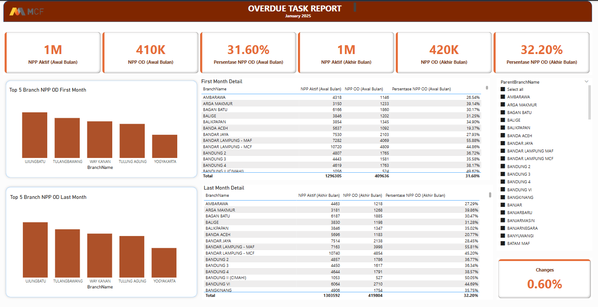

# 📊 Dashboard Power BI - Evaluasi KPI untuk Tim Collection

## 📌 Ringkasan Proyek
Proyek Power BI ini bertujuan untuk mengevaluasi **KPI Tim Collection** selama satu bulan. Analisis difokuskan pada perbandingan **persentase nomor kontrak yang overdue** pada awal dan akhir bulan.

## 🎯 Tujuan
Membuat dashboard yang memberikan wawasan tentang **jumlah kontrak aktif, kontrak yang overdue, dan persentasenya** di setiap **cabang utama dan pos cabang**.

## 📈 Metode Evaluasi
- 🔹 **Total Kontrak Aktif**
- 🔹 **Kontrak Overdue di Awal Bulan**
- 🔹 **Kontrak Overdue di Akhir Bulan**
- 🔹 **Persentase Kontrak Overdue per Cabang**
- 🔹 **Perbandingan Persentase Overdue antar Cabang Utama dan Pos Cabang**

## ⚙️ Fitur & Fungsionalitas
- 📊 **Dashboard Dinamis:** Visual interaktif yang menampilkan metrik utama.
- 🏢 **Pembagian Berdasarkan Cabang:** Data dikelompokkan berdasarkan **cabang utama** dan **pos cabang**.
- 📉 **Analisis Tren Overdue:** Perbandingan persentase overdue pada waktu yang berbeda.
- 🎛️ **Opsi Filter:** Filter berdasarkan cabang, wilayah, dan status kontrak.

## 🔍 Sumber Data
Data untuk proyek ini berasal dari **database internal tim collection**, dengan **hanya menggunakan sampel data yang telah disamarkan untuk angkanya**, memastikan akurasi dalam pelacakan tren kontrak overdue tanpa menampilkan informasi sensitif.

## 🎯 Hasil yang Diharapkan
- 🔍 **Visibilitas yang lebih baik terhadap tren kontrak overdue** di berbagai cabang.
- ⚠️ Identifikasi **cabang berisiko tinggi** dengan persentase overdue tinggi.
- 📢 Peningkatan pengambilan keputusan untuk **penyesuaian strategi penagihan utang**.

## 🛠️ Alat yang Digunakan
- 📊 **Power BI** (Visualisasi Data & Dashboarding)
- 🗄️ **SQL** (Ekstraksi & Pemrosesan Data)
- 📂 **Excel/CSV** (Praproses Data, jika diperlukan)

## 🚀 Langkah 
- 🔄 Ekstraksi dan praproses data
- 🎨 Desain dashboard dan setup visualisasi
- ✅ Validasi dan pengujian wawasan
- 🚀 Implementasi untuk penggunaan oleh Tim Collection

## Tampilan Dashboard

---
Silakan berikan masukan atau saran untuk perbaikan! 😊

