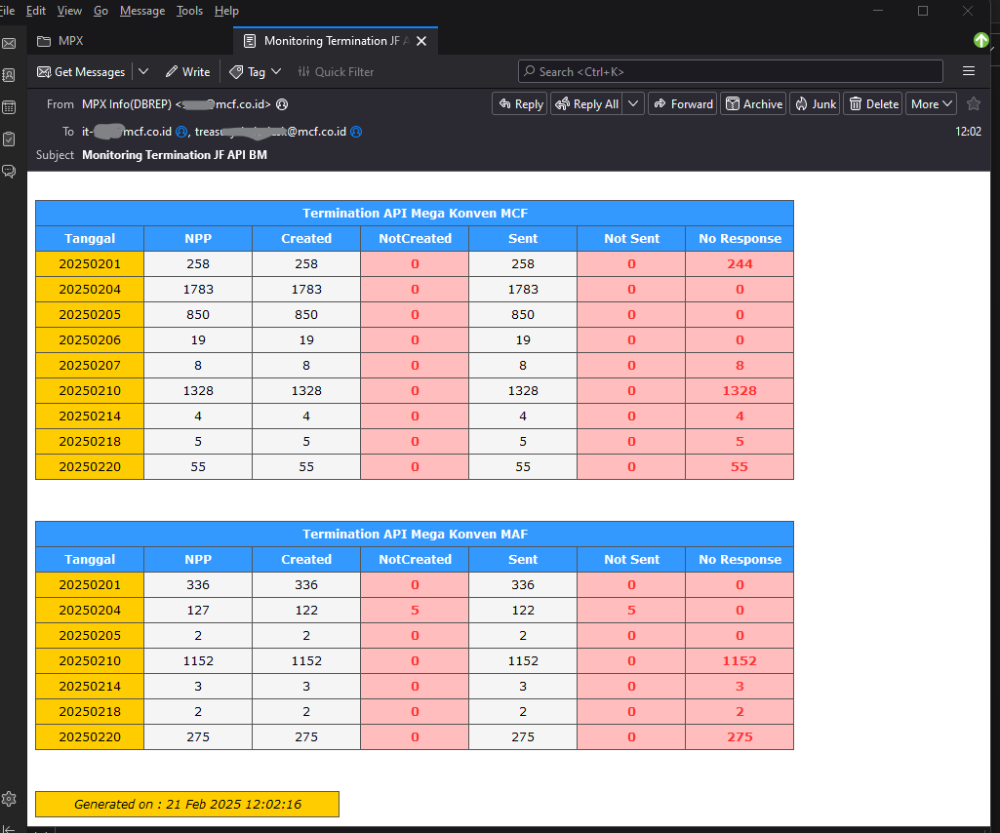

# Monitoring Termination JF API

## Deskripsi  
Report automation ini digunakan oleh tim Cash Management dan IT MIS untuk memonitor proses pelunasan ke bank melalui API.

## Fitur Utama  
- Menampilkan status proses pelunasan ke bank menggunakan API.  
- Disajikan langsung di body email tanpa attachment.  
- Dikirim otomatis setiap hari mulai pukul 09.00, dengan interval setiap 3 jam hingga pukul 18.00.

## Jadwal Pengiriman  
| Waktu Pengiriman | Frekuensi |
|-----------------|-----------|
| 09:00 WIB      | ✅ |
| 12:00 WIB      | ✅ |
| 15:00 WIB      | ✅ |
| 18:00 WIB      | ✅ |

## Teknologi yang Digunakan  
- SQL untuk ekstraksi dan pemrosesan data  
- SQL Job Schedule untuk otomatisasi pengiriman email  

## Cara Kerja  
1. Job Schedule di SQL dijalankan sesuai jadwal untuk mengambil data pelunasan ke bank.  
2. Data diolah dan diformat agar sesuai untuk ditampilkan di body email.  
3. Email dikirimkan ke penerima yang ditentukan sesuai dengan jadwal.  

## Penerima Email  
- Tim Cash Management  
- Tim IT MIS

## Tampilan Email

 
